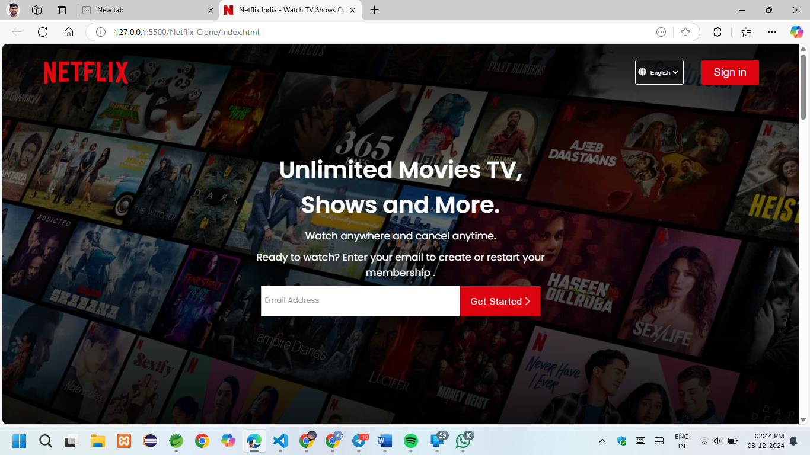
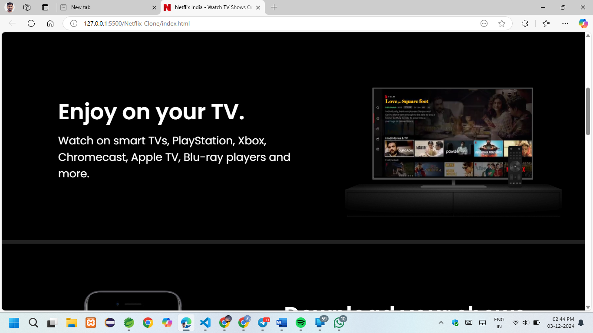
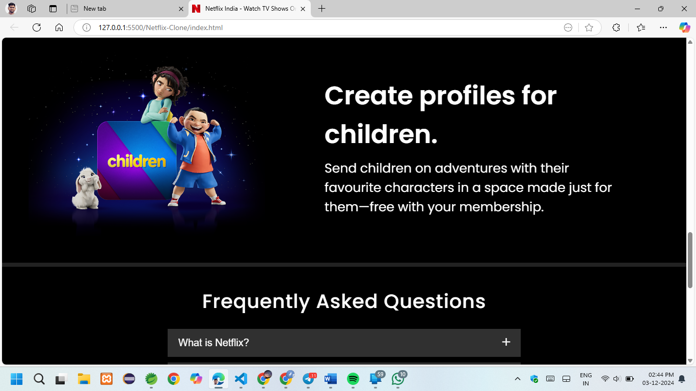
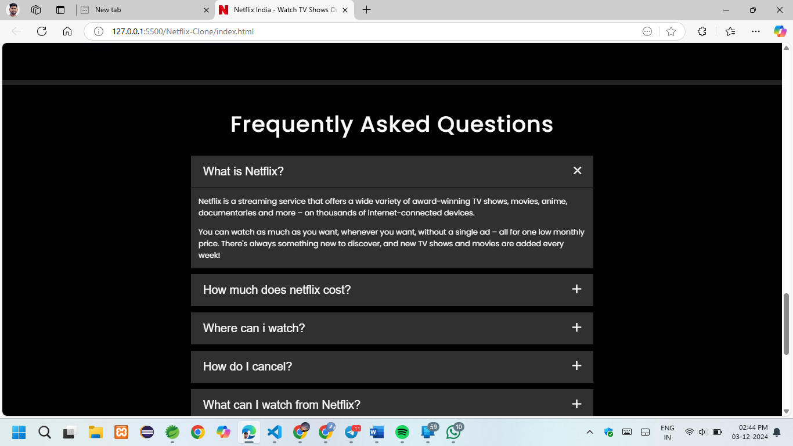
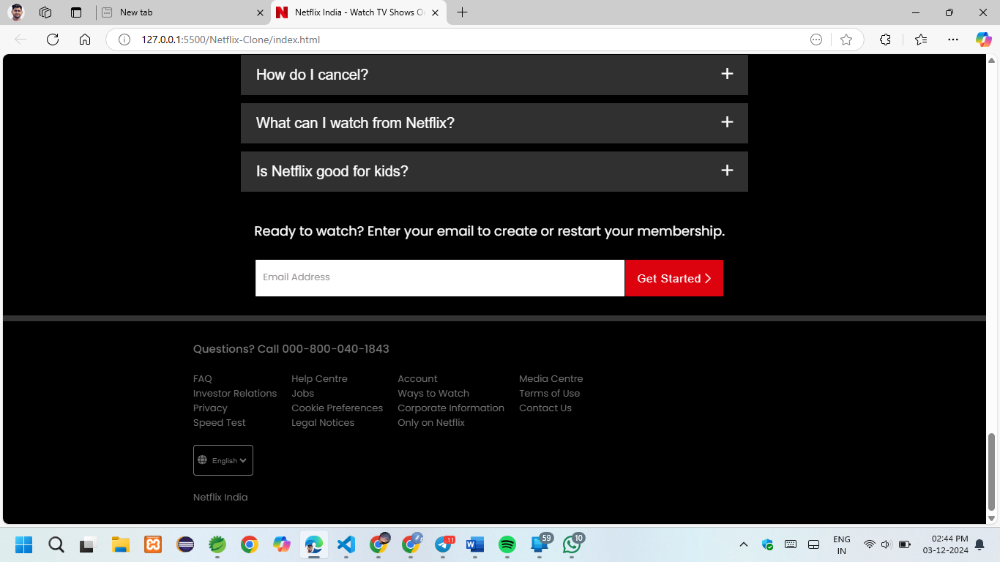

# Netflix-Clone
This is the core code from scratch to clone the landing page of Netflix using **HTML, CSS and JavaScript.**

## 📸 Screenshots







## ⭐ HOW TO MAKE A PULL REQUEST:


Follow these steps to create a pull request in GitHub:

## 1. Fork or Clone the Repository
- Fork the repository if it's not yours.
- Clone the repository to your local system using:
  ```bash
  git clone <repository_url>

## 2. Navigate to the project directory
- cd <project_directory>
## 3. 
- git checkout -b <branch_name>

 

**Congratulations!** You've made your first contribution! 🙌🏼


## All the best! 🥇

<p align="center">

[](https://github.com/Susmita-Dey/Netflix-Clone)

</p>
